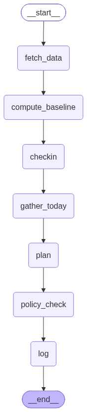

# oura-coach
Personal Agent to improve over personal lifestyle

## Setup

Requires Python 3.11+.

```bash
python3 -m venv .venv
source .venv/bin/activate
pip install -r requirements.txt
```

Create a `.env` in the repo root with these keys:

```
OPENAI_API_KEY=
OURA_CLIENT_ID=
OURA_CLIENT_SECRET=
OURA_ACCESS_TOKEN=
OURA_REFRESH_TOKEN=
TELEGRAM_BOT_TOKEN=
TELEGRAM_CHAT_ID=
GCAL_ICAL_URL=        # Google Calendar > Settings > "Secret address in iCal format"
```

The Oura tokens in `.env` are only used once, to seed the SQLite database
(`oura_coach.db`). Oura refresh tokens are single-use, so after that the
database holds the current pair and updates it on every refresh. To start over
with new tokens, put them in `.env` and delete `oura_coach.db`.

## Smoke test (Milestone 1)

```bash
python scripts/smoke_test.py
```

This pulls the last 7 days from Oura, saves the raw responses to `fixtures/`
(gitignored), prints a per-day summary, and lists today's free slots
(06:00–21:00 America/Chicago).

## Agent brain (Milestone 2)

```bash
python log_food.py "chicken rice bowl and a diet coke"   # log anything you eat or drink (--at HH:MM for a past time)
python run.py --energy 4 --soreness 2                     # plan a workout for now (live Oura + Calendar)
python run.py --fixtures --at 07:00                       # offline demo from fixtures/, writes demo.db
python run.py --fixtures --at 07:00 --simulate-hard-yesterday   # demo: code overrides a back-to-back hard day
python scripts/show_runs.py -n 2                          # LLM inputs/outputs for the last runs
pytest -q
```

The model is read from `OPENAI_MODEL` (default `gpt-5-mini`). Food estimates are
rough LLM guesses. For a fixtures demo with food, log it with `log_food.py --demo`.

## Telegram coach (Milestone 3)

1. Create a bot with [@BotFather](https://t.me/BotFather) and put its token in `TELEGRAM_BOT_TOKEN`.
2. Send your bot a message, then open `https://api.telegram.org/bot<token>/getUpdates` and copy
   `message.chat.id` into `TELEGRAM_CHAT_ID`. The bot ignores every other chat.
3. Run it:

```bash
python bot.py               # live Oura + Calendar, oura_coach.db
python bot.py --fixtures    # fixtures/ + demo.db
```

Talk to it in plain messages:

| You send | It does |
| --- | --- |
| `want to work out now` or `/checkin` | Fetches fresh Oura + calendar + today's food and activity, asks energy / soreness, then plans a workout for now (until your next event) |
| `had poha`, `lunch at 1: rajma chawal` | Logs food at the message time or the time you gave, with rough macros |
| `traveling Thu-Sat, keep it light` | Saves a context note; dates are resolved in code and confirmed |
| `did the run, felt heavy` | Marks your latest plan done |
| `went for a 30 min walk` | Logs an unplanned workout |
| `what should I eat for dinner?` | Answers from today's data (food so far vs targets) |

Commands: `/checkin`, `/plan` (plan now, reusing today's latest check-in), `/food <text>`,
`/note <text>`, `/undo` (last food or note), `/today`, `/help`.

Daily food targets are computed in code from your Oura `personal_info` (age, weight, height,
sex) with the Mifflin-St Jeor formula and the coefficients in `goals.yaml` (`nutrition`).

### The graph



One LangGraph thread per check-in (`checkin-YYYY-MM-DD-HHMM`), checkpointed in SQLite, so a
check-in survives a bot restart. Redraw with `python scripts/draw_graph.py`. Explore it in
LangGraph Studio with `langgraph dev` (always runs on fixtures and demo.db).

On first start after upgrading from M2, `oura_coach.db` is copied to
`oura_coach.backup-<timestamp>.db` and then migrated (plans move to the `sessions` table).

## Files

| File | Purpose |
| --- | --- |
| `config.py` | Settings: time zone, DB paths, free-slot window, `redact()` for secrets |
| `db.py` | SQLite tables: `tokens`, `daily_log`, `sessions`, `context_notes`, `food_log`, `runs`; backup + migration |
| `oura_client.py` | Oura API v2 client (refresh on 401), `daily_metrics()` and `body_metrics()` parsers |
| `calendar_client.py` | iCal feed → busy blocks, all-day events, free slots, `plan_window()` |
| `scripts/smoke_test.py` | End-to-end check of the data layer (also saves `fixtures/`) |
| `baseline.py` | Today vs 7-day baseline, readiness band, food sums (pure functions) |
| `activity.py` | Oura workouts merged with sessions reported in chat; hard / worked-out rules |
| `nutrition.py` | Daily food targets and what is left of them |
| `timeparse.py` | "at 1", "8am" → times; "Thu"-"Sat" → dates |
| `policy.py` | Hard training rules enforced in code after the LLM plan |
| `today.py` | One view of today (Oura, calendar, food, activity, targets) shared by graph and chat |
| `schemas.py` | Pydantic models for structured LLM output (`Plan`, `FoodEstimate`, `RouterResult`, `Answer`) |
| `llm.py` | ChatOpenAI wrapper; records every call in the `runs` table |
| `graph.py` | LangGraph: fetch_data → compute_baseline → checkin ⏸ → gather_today → plan → policy_check → log |
| `router.py` | One LLM call that turns a message into actions |
| `chat.py` | Message in, reply out (no Telegram code; tested offline) |
| `bot.py` | Telegram glue |
| `food.py` / `log_food.py` | Food logging with rough macro estimates |
| `prompts/` | Prompt text (`plan.md`, `food.md`, `router.md`, `answer.md`) |
| `run.py` | Terminal entry point (same graph, check-in answered from flags) |
| `studio.py` / `langgraph.json` | `langgraph dev` entry point |
| `scripts/show_runs.py` | Print LLM traces for demos |
| `scripts/draw_graph.py` | Writes `docs/graph.mmd` and `docs/graph.png` |
| `tests/` | Unit and integration tests (LLM stubbed; live router tests need `RUN_LIVE_LLM=1`) |
