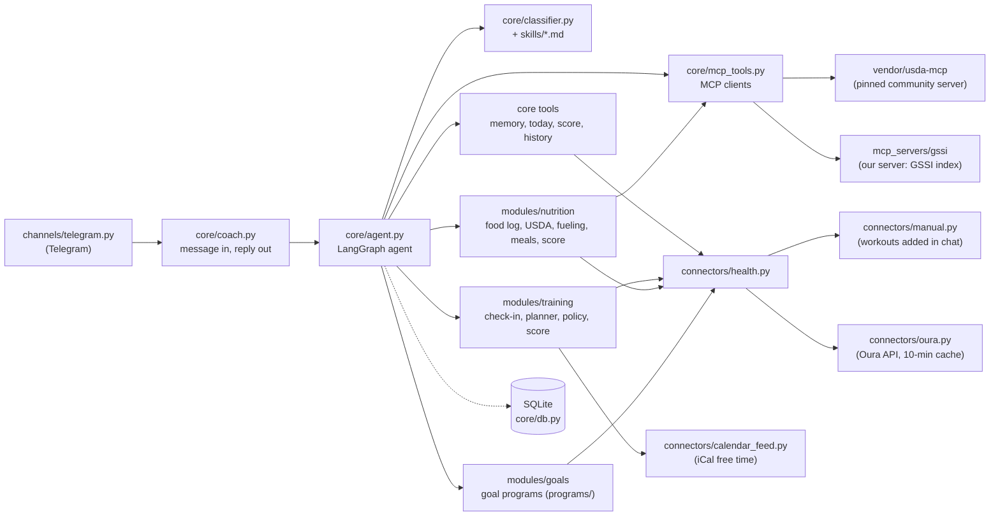
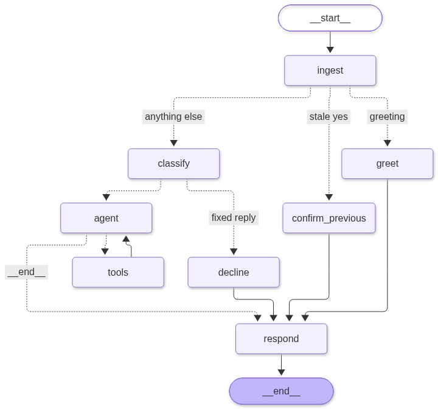
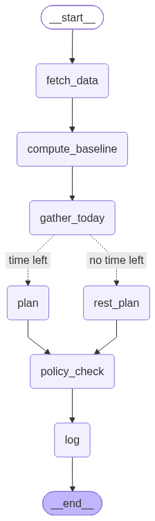

# oura-coach

A personal running, strength and nutrition coach you text on Telegram. It reads your Oura ring
(sleep, readiness, HRV, workouts, steps) and your Google Calendar, plans a workout for right now,
logs what you eat (with USDA FoodData Central numbers when it can look them up), answers fueling questions
from the Gatorade Sports Science Institute's articles, runs goal programs (a half marathon first), remembers
what you tell it, and gives each day a score you can compare to your own recent average.

**The rule the whole design follows: the LLM proposes and words things; code decides.** Every number,
time, date and training rule is computed in plain Python and tested. The model understands messages,
picks tools, proposes plans and meal ideas, and writes the sentences, inside limits that code checks
before a reply is sent.

---

## Architecture


```mermaid
flowchart LR
    TG["channels/telegram.py<br/>(Telegram)"] --> COACH["core/coach.py<br/>message in, reply out"]
    COACH --> AGENT["core/agent.py<br/>LangGraph agent"]
    AGENT --> CLS["core/classifier.py<br/>+ skills/*.md"]
    AGENT --> CORE_TOOLS["core tools<br/>memory, today, score, history"]
    AGENT --> TRAIN["modules/training<br/>check-in, planner, policy, score"]
    AGENT --> NUTR["modules/nutrition<br/>food log, USDA, fueling, meals, score"]
    AGENT --> GOALS["modules/goals<br/>goal programs (programs/)"]
    AGENT --> MCP["core/mcp_tools.py<br/>MCP clients"]
    MCP --> GSSI["mcp_servers/gssi<br/>(our server: GSSI index)"]
    NUTR --> MCP
    MCP --> USDA["vendor/usda-mcp<br/>(pinned community server)"]
    CORE_TOOLS --> HEALTH["connectors/health.py"]
    TRAIN --> HEALTH
    NUTR --> HEALTH
    GOALS --> HEALTH
    HEALTH --> OURA["connectors/oura.py<br/>(Oura API, 10-min cache)"]
    HEALTH --> MANUAL["connectors/manual.py<br/>(workouts added in chat)"]
    TRAIN --> CAL["connectors/calendar_feed.py<br/>(iCal free time)"]
    AGENT -.-> DB[("SQLite<br/>core/db.py")]
```

| Layer | What lives there | Knows about |
| --- | --- | --- |
| `channels/` | Telegram glue: who is writing, text in, text out | `core.coach` only |
| `core/` | The agent, the classifier, users, chat sessions, saved memory, reply rules, citations, MCP clients, models, the Oura-defined day, the daily score, storage | modules through the registry |
| `skills/` | One file per message category: what it covers, examples, its tools, its guidance, its eval rubric | tool names |
| `modules/` | One coaching area each (`training`, `nutrition`, `goals`): tools, deterministic rules, a score | `connectors/health.py`, never a device API |
| `programs/` | The goal engine's data: template schema, safety validator, templates | nothing in the app |
| `connectors/` | Where data comes from: Oura, workouts added in chat, the calendar | nothing above them |
| `mcp_servers/` | Our own MCP server (GSSI search over a local index) | nothing in the app |
| `evals/` | Rubric checks, the judge, the eval runner | the app, as a user would |
| `config/` | Models and prices, score weights, fueling ranges, program safety, movements, MCP servers, fallback meals | |
| `goals.yaml` | Your goals and training rules (readiness floor, hard days per week, rest days, food targets) | |

Each layer only imports the one below it. A module can be turned on or off per person
(`user_settings.enabled_modules`); the agent is only shown the tools of enabled modules.

### How one message flows

Say you send **"done, what should I eat now?"** at 1:10pm.

1. **`channels/telegram.py`** checks the chat belongs to a known user and hands the text to `Coach`.
2. **`core/coach.py`** logs the message to your chat session (a new session starts after 15 quiet
   minutes; each session is one LangGraph thread) and runs the agent.
3. **`ingest`** (code): expires a "still want HIIT?" question left unanswered for 2 hours, finalizes the
   score of any day whose 21:00 cutoff has passed, adjusts an active goal program, and drops a check-in
   question left in an earlier session.
4. **`classify`** (LLM, small and fast): picks 1–2 categories from the skill files, here `logging` and
   `nutrition`. Only those skills' tools and guidance reach the agent. An off-topic message gets a fixed
   line from code instead.
5. **`agent`** (LLM): sees a system message with the time, *which day it is by your sleep*, your saved
   facts, a short summary from each module and the chosen skills' guidance, plus this session's conversation.
   It calls tools: `mark_done` and `suggest_meal`.
6. **`tools`** (code): `mark_done` fetches Oura again and marks the plan done **with Oura's exact times**,
   or says Oura has no matching workout (it never makes times up). `suggest_meal` sizes one meal from
   what's left of today's targets, asks the LLM for 1–2 dishes, drops anything suggested in the last
   5 days, and formats portions in grams and katoris.
7. **`respond`** (code): text built by tools is sent exactly as built. The model's own words go through
   the reply rules: at most 3 lines and about 60 words, no internal terms, no "I logged" / "I synced"
   unless that tool really ran this turn, no credit to a source in its own words. A broken draft is
   rewritten once, then trimmed by code. Code adds the source lines (GSSI links, "Numbers: USDA FoodData
   Central (…)"), and "General guidance, not medical advice." on pain, injury and illness answers.

```
Marked done: HIIT 12:12–1:03pm (from Oura). How did it feel?

For lunch, about 776 kcal and 44 g protein:
1. Dal palak with rice · about 776 kcal, 41 g protein
   cooked dal with spinach 380 g (1 3/4 cups) · cooked rice 150 g (3/4 cup) · ghee 13 g (1 tbsp)
2. Egg bhurji with dal and rice · about 772 kcal, 46 g protein
   ...
```

### The two graphs

| The agent (`core/agent.py`) | The workout planner (`modules/training/planner.py`) |
| --- | --- |
|  |  |

The **planner** runs once a check-in is answered. Only `plan` calls the LLM; everything else is code:
- `rest_plan`: it's late (after 21:00 or before 06:00) or there is no free time before your next event.
- `consult`: you asked for a workout the rules would change. It asks once ("Readiness is 64 today, lower than
  usual, so I'd keep it light. I'd suggest a 30-min walk instead. Still want HIIT?") and stops.
- `suggested_plan`: you said no, so it plans the suggestion as offered.
- `policy_check`: enforces the rules from `goals.yaml` after the LLM proposes: readiness floor,
  how recovered you are, already trained today, no back-to-back hard days, the weekly cap on hard days,
  long runs only on weekends, recent meals and free time.

Redraw both with `python scripts/draw_graph.py`; explore them with `langgraph dev` (always on fixtures).

---

## What you can say

Plain messages; the only commands are `/start` and `/help`.

| You send | What happens |
| --- | --- |
| `hi` | One line with today's readiness. No LLM call. |
| `want to work out now` / `want HIIT` | Asks energy (1–5) and soreness (0–5), then plans a workout for right now, until your next calendar event. |
| `4 2 legs heavy` / `5 0 give me run + strength` / `skip` | Your check-in answer. A request becomes the plan's parts, in your order. |
| `yes` / `no` | Your answer to "Still want HIIT?" (good for 2 hours). |
| `done` | Marks the plan done with Oura's times, or offers to add it with a time. |
| `did 40 min HIIT at 7` | Adds a workout Oura missed. |
| `why?` | The reasoning, the numbers and every rule code applied. |
| `had poha and chai at 8` / `a 30 cal soda` | Logs it with a rough estimate; your numbers win over the estimate. |
| `correction, it's 9g carbs` / `it was cheese pizza, edit that` | Fixes that entry in place, never a second row. |
| `remove the pizza` / `delete the last two` | Removes entries; asks which one if it's unclear. |
| `what did I eat on Oct 10?` / `last Monday` | That day's entries and totals. |
| `dinner ideas, I have dal, rice and spinach` → `the second one` → `make it higher protein` | Two dishes sized for one meal, then the recipe, then a higher-protein version of the same dish. |
| `how's my day?` | Your score so far vs your own 7-day average, and one kind suggestion ("a 20-min walk would round today out"). |
| `remember I'm traveling Thu–Sat, keep it light` / `what do you know about me?` / `forget that` | Saved facts, with dates resolved in code. |
| `update from Oura` | Fetches again and says honestly whether anything new came in. |
| `how much protein is in a Chobani plain Greek yogurt?` / `200 g chicken, a cup of rice` | Looked up in USDA FoodData Central and summed by code (the same numbers whether you ask or log it); approximate when USDA has no match. |
| `My long run is Saturday. What should I eat and drink Friday and Saturday?` | A fueling plan computed by code from GSSI's ranges, your weight and your recent runs, a line about your week, and the articles' links. |
| `I want to run a half marathon on Feb 15 2027` → answers → `yes` | A few questions, two at a time, then the plan before anything is saved; `what's today's session?`, `am I on track?` afterwards. |
| `my knee hurts when I run` | General guidance, when to see a physio, and an offer to plan around it (saved as a limit the planner enforces). |
| `what was my protein intake across the past 7 days?` / `which day this week was I lowest?` | Totals, averages and patterns over any range up to 90 days. |

---

## Interfaces

### Module (`modules/base.py`)

```python
class Module(Protocol):
    name: str
    def setup_questions(self) -> list[str]: ...          # onboarding (M5)
    def tools(self) -> list: ...                          # LangChain tools the agent may call
    def context(self, user, day) -> str: ...              # a few lines for the agent's system message
    def nudges(self) -> list[NudgeSpec]: ...              # declared only; M4 sends them
    def score(self, user, day, now=None) -> ScoreComponent: ...   # deterministic share of the daily score
    def help_lines(self) -> list[str]: ...                # plain-language lines for /help
```

`ScoreComponent(name, fraction 0–1 or None, note, details, next)`: `None` means "no data, leave me out"
(the other components are re-weighted); `next` is a plain fact about what would still help today.

### HealthSource (`connectors/base.py`)

```python
class HealthSource(Protocol):
    def readiness(self, user, day) -> dict | None: ...    # {"score", "temperature_deviation"}
    def sleep(self, user, day) -> dict | None: ...        # the main sleep that ended on `day`
    def workouts(self, user, day) -> list[dict]: ...      # start, end, minutes, activity
    def activity(self, user, day) -> dict | None: ...     # steps, active calories
```

`OuraSource` and `ManualSource` implement it; `connectors/health.py` combines them and is the only thing
modules call. Oura fields are parsed only from responses saved in `fixtures/` (never invented).

### How to add a module

Say, a `sleep` module that coaches wind-down routines:

1. Create `modules/sleep/module.py` with a class that has the six methods above (copy
   `modules/nutrition/module.py` as a start). Keep its rules as plain functions in the same package,
   with their own tests.
2. Put its tools in `modules/sleep/tools.py`. Tools read who/when from the run config with
   `core.tools.turn(config)`, return short JSON for the model, and put any text you want sent exactly as
   built in the artifact `{"verbatim": text}`.
3. Register it in `modules/registry.py`: `"sleep": "modules.sleep.module:SleepModule"`.
4. Turn it on for a person: add `"sleep"` to their `user_settings.enabled_modules`.
5. To count it in the daily score, return a `ScoreComponent` from `score()` and give it a weight in
   `config/score.yaml` under the person's template.
6. Add its scenarios to `docs/scenarios.md` and a scripted and a live test to `tests/test_replay.py`
   (the coverage test fails until you do).

---

## Skills and the classifier

Every message is routed before the agent sees it. `core/classifier.py` asks a small model which of the
categories in `skills/*.md` fit (one or two, or "other"), using the message, the last few turns and any
question the coach is waiting on. The agent then gets only those skills' tools and guidance. A message
that fits nothing gets every tool and is saved to `unclassified_messages` for review.

A skill file is frontmatter plus guidance:

```markdown
---
name: fueling_hydration
description: Eating and drinking around a workout or race ...
examples: ["What's a good meal before my long run tomorrow, and how early should I have it?", ...]
tools: [fueling_plan, search_gssi, get_today, workouts]
rubric:                     # yes/no checks the evals grade every reply by
  - {check: "fueling_plan and search_gssi were called", by: code, id: tools_called, all: [fueling_plan, search_gssi]}
  - {check: "Its own line ties the answer to their day or recent training", by: judge}
---
- fueling_plan's text is sent to them as built ...
```

### How to add a category

1. Write `skills/<name>.md` with `name`, `description`, 2–3 `examples`, its `tools` (existing tool names;
   an unknown one fails at startup), its guidance and a 3–6 check `rubric`. Skills are read on every
   message, so the next message can already land there (`docs/demo/gear.md` is a ready example).
2. Label a few messages for it in `tests/data/classifier_set.jsonl` and run `python scripts/eval_classifier.py`
   (targets: 90% overall, 98% for logging).
3. Add 5–10 cases to `tests/data/eval_set.jsonl` and run `python scripts/run_evals.py --only <name>`.

## Outside knowledge over MCP

Two MCP servers run over stdio, each with only the environment variables `config/mcp.yaml` lists. A server
that's down, slow or broken never blocks a reply: the answer is marked approximate instead.

- **GSSI** (`mcp_servers/gssi/`, ours): `search_gssi` over a local Chroma index of 22 Sports Science Exchange
  articles. The coach writes [n] after a claim a passage states; one yes/no model call per marker checks it,
  and code adds the links. Next to a code-built fueling plan the coach's line has no markers: the plan's
  Amounts line credits every range it used. The article text is never in this repo.
- **USDA FoodData Central** (`vendor/usda-mcp`, FelipeAdachi/mcp-food-data-central pinned at 47addeb): the
  model only reads "200 g chicken and a cup of rice" into items and amounts; code looks each one up, turns
  the amount into grams and sums.

```bash
python scripts/ingest_gssi.py         # re-ingest GSSI: reads docs/gssi_sources.txt, uses pages saved in data/gssi_raw/
                                      # (gssiweb.org is never fetched: save new pages from a browser); unchanged text is skipped
bash scripts/install_usda_mcp.sh      # install the USDA server: exact commit, dependencies from its uv.lock
                                      # (uv sync --locked, or pip --require-hashes from a requirements file made from uv.lock)
```

## Goal programs

`modules/goals` turns a goal into a dated plan; code makes the plan, the model only words it.

- **Templates** (`programs/library/*.yaml`) are data: disciplines and session types, level variants with their
  weeks, placement rules ("no leg day the day before the long run"), caps. `programs/validate.py` checks every
  template and every generated plan against `config/program_safety.yaml`: weekly load at most +25% over the
  best of the 3 weeks before, the long session at most +25% over the longest in 30 days, a rest day every week,
  a taper. Only a valid, `approved` template can make a plan.
- **The profile** comes from a few questions (two at a time) plus your data, which beats an answer. Injuries
  are structured limits (`config/movements.yaml`) that the generator and the workout planner both enforce.
- **Adjustments** run daily: a missed easy run is dropped, a missed long run moves, two misses repeat the week,
  and the plan is validated again after every change.

### How to add a program template

1. Copy `programs/library/half_marathon.yaml` to `programs/library/<name>.yaml`; set `matches` (the goal words
   that pick it), `event`, `asks_user`, the disciplines and each variant's weeks. Say in a comment where the
   numbers come from.
2. `pytest -q tests/test_program_validate.py`: every library template must pass the validator.
3. Keep `status: approved` only once you've checked it; `pending_review` templates never make a plan.
   `programs/examples/` shows non-running goals (an Ironman, a day hike) that are never offered.

## Evals

Every skill's rubric is graded on real replies: code checks where code can tell (numbers come from tools, the
right tools ran, links present, reply rules), a judge model (`config/models.yaml` job `judge`) for the rest,
each yes / no / n/a with a one-line reason.

```bash
python scripts/run_evals.py --trials 3 --publish    # every case 3 times: docs/evals/<date>.md (totals only)
python scripts/run_evals.py --only G-8 --trials 5   # one case or category
python scripts/run_evals.py --effort agent=low      # reasoning effort for one run
python scripts/calibrate_judge.py --score           # your marks vs the evals' answers, per check
```

The report gives, per category: routing accuracy, checks passed, trials fully passed, pass^3 (all three
passed), latency, tokens, cost and models. Your own questions are eval cases, but they never reach the repo:
per-case data stays in `data/evals/` (gitignored) and LangSmith, and a test fails if `docs/evals/` or any
tracked file has one of your messages. Rubric changes are logged with their reason in
`docs/evals/rubric_changes.md`.

---

## The daily score

`core/score.py` adds four components with weights from `config/score.yaml`. At moderate rigor:

| Component | Weight | Measures |
| --- | --- | --- |
| Training | 35 | The plan happened (minutes per part vs planned). Rest days are inferred: a day without a workout is full credit within your weekly rest days, or when readiness was low or a saved fact (travel, sick) covers it. |
| Nutrition | 30 | Protein vs target, calories within ±10% (never rewards eating far too little), meals logged. |
| Recovery | 20 | What you control: time in bed vs target, bedtime vs your usual, and taking it easy on a low-readiness day. Low readiness or a restless night alone never lowers it. |
| Movement | 15 | Steps vs 8,000. |

A component with no data (no wearable, no steps) is left out and the rest re-weighted, never scored 0.
The score is final at 21:00 and never changes after that. "How's my day" compares it to your own average:
"74 so far, up from your 68 average". There are no streaks and no comparisons to anyone else.

---

## Setup

Python 3.11+.

```bash
python3 -m venv .venv && source .venv/bin/activate
pip install -r requirements.txt
```

`.env` in the repo root (never committed, never logged):

```
OPENAI_API_KEY=
OURA_CLIENT_ID=
OURA_CLIENT_SECRET=
OURA_ACCESS_TOKEN=
OURA_REFRESH_TOKEN=
TELEGRAM_BOT_TOKEN=
TELEGRAM_CHAT_ID=
GCAL_ICAL_URL=        # Google Calendar > Settings > "Secret address in iCal format"
USDA_API_KEY=         # api.data.gov key, for the USDA FoodData Central server
LANGSMITH_TRACING=    # optional: true sends traces (secrets redacted in code first)
LANGSMITH_API_KEY=
LANGSMITH_PROJECT=
OPENAI_MODEL=         # optional: overrides config/models.yaml for the classifier, agent and structured jobs
```

Oura refresh tokens are single-use: the `.env` pair only seeds the database, which then keeps the
current pair. For Telegram, create a bot with [@BotFather](https://t.me/BotFather), message it, and put
your chat id (from `https://api.telegram.org/bot<token>/getUpdates`) in `TELEGRAM_CHAT_ID`.

## Run

```bash
python scripts/smoke_test.py         # pull 7 days of Oura into fixtures/ (gitignored), print a summary
python bot.py                        # the Telegram coach (live Oura + calendar, oura_coach.db)
python bot.py --fixtures             # same, on fixtures/ and demo.db
python run.py --fixtures --at 07:00 --energy 4 --soreness 2      # one planner run in the terminal
python run.py --fixtures --at 07:00 --simulate-hard-yesterday --request "45 min HIIT" --choose yes
python log_food.py "2 eggs, toast and chai"                     # log food from the terminal
python scripts/show_runs.py --last 3 # the last LLM calls: prompt, input, output, tokens, cost, latency
python scripts/check_models.py       # one call per configured model
langgraph dev                        # LangGraph Studio on fixtures
```

## Tests

```bash
pytest -q                                              # everything, LLM stubbed (about 15 s)
RUN_LIVE_LLM=1 pytest -q -s tests/test_replay.py -k live           # every scenario against the real model
RUN_LIVE_LLM=1 LIVE_RUNS=3 pytest -q tests/test_replay.py -k live  # 3 runs each, with a pass-rate table
python scripts/eval_classifier.py                                   # routing accuracy on the labeled messages
python scripts/run_evals.py --trials 3                              # rubric evals (see Evals)
```

`docs/scenarios.md` is the eval set: real conversations, each with what must and must not happen. Every
scenario has a **scripted** test (preset model turns, so it checks the code around the model: tools,
database rows, reply rules) and a **live** test (the real model, so it checks the understanding).
★ scenarios must pass every live run; an LLM judge is used only for "did it answer what was asked".
Scripted tests use a fake classifier that reads the labeled set, so every scenario proves its skill offers
the tools it uses.

## Files

| Path | Purpose |
| --- | --- |
| `core/agent.py` | The LangGraph agent: ingest → greet / classify → agent ⇄ tools → respond |
| `core/classifier.py`, `core/skills.py`, `skills/` | Routing a message to its skills |
| `core/models.py`, `config/models.yaml` | Which model does which job, and its price |
| `core/mcp_tools.py`, `config/mcp.yaml`, `mcp_servers/` | MCP clients (persistent sessions, fallbacks), our GSSI server |
| `core/citations.py` | [n] markers checked against their passages, source lines, Telegram links |
| `core/coach.py` | Message in, reply out (no Telegram code, so it's tested offline) |
| `core/tools.py` | Core tools: remember, forget, list_memory, get_today, get_score, refresh_health |
| `core/reply_rules.py` | Length, plain words, no claims without the tool |
| `core/score.py` | The daily score: components, re-weighting, final after the cutoff, own average |
| `core/day.py` | Which day an event belongs to: a day starts when your main sleep starts |
| `core/memory.py`, `core/chat_sessions.py`, `core/users.py` | Saved facts, 15-minute sessions, people and their settings |
| `core/db.py` | SQLite (every user-owned row has `user_id`), backups before any migration |
| `core/timeparse.py` | "at 1", "8am", "Thu–Sat", "last Monday" → times and dates |
| `core/labels.py` | Plain labels, 12-hour times, workout phrases |
| `modules/training/` | Check-in parsing, the planner graph, policy rules, plan parts, activity merge, score |
| `modules/nutrition/` | Food logging and edits, USDA lookups, fueling plans, targets, meal ideas, score |
| `modules/goals/`, `programs/` | Goal programs: profile, feasibility, generator, adjustments, direction goals; templates and validator |
| `evals/`, `scripts/run_evals.py`, `scripts/calibrate_judge.py` | Rubric evals and judge calibration |
| `connectors/` | Oura client and parsers, manual workouts, calendar, the combined health view |
| `channels/telegram.py` | Telegram glue (`bot.py` is the entry point) |
| `today.py` | One view of a day (Oura, calendar, food, activity, targets) shared by the planner and tools |
| `prompts/` | Prompt text: `agent`, `classifier`, `plan`, `checkin`, `food`, `meal`, `recipe`, `citation_check`, `direction_rules` |
| `config/` | `models.yaml`, `score.yaml`, `fueling.yaml`, `program_safety.yaml`, `movements.yaml`, `direction_rules.yaml`, `mcp.yaml`, `meals.yaml` |
| `docs/` | `scenarios.md` (scenario tests), `evals/` (eval reports, rubric changes), `demo.md`, plans, graph drawings |
| `tests/` | Unit tests, scripted + live replay scenarios (`test_replay.py`) |
